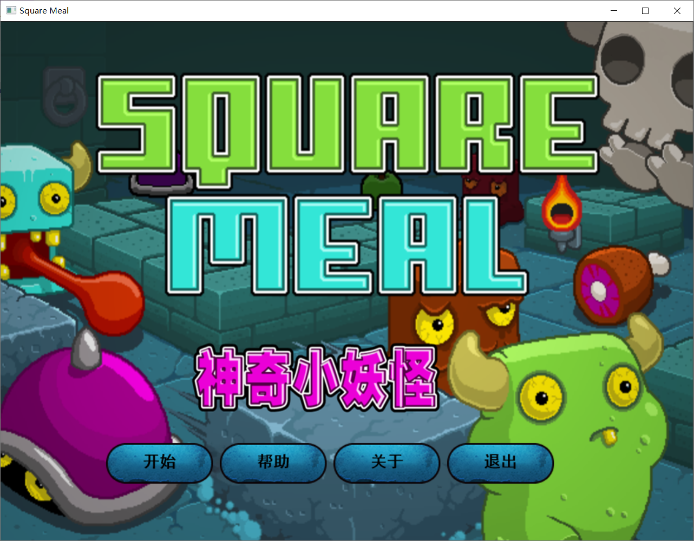
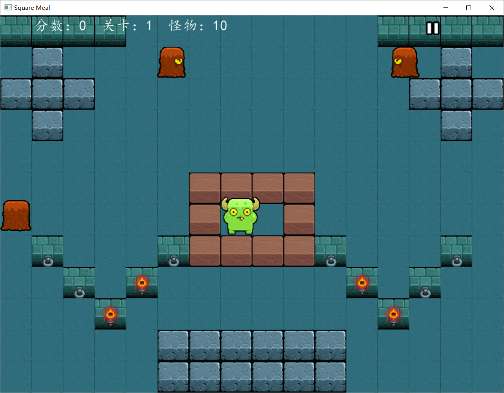
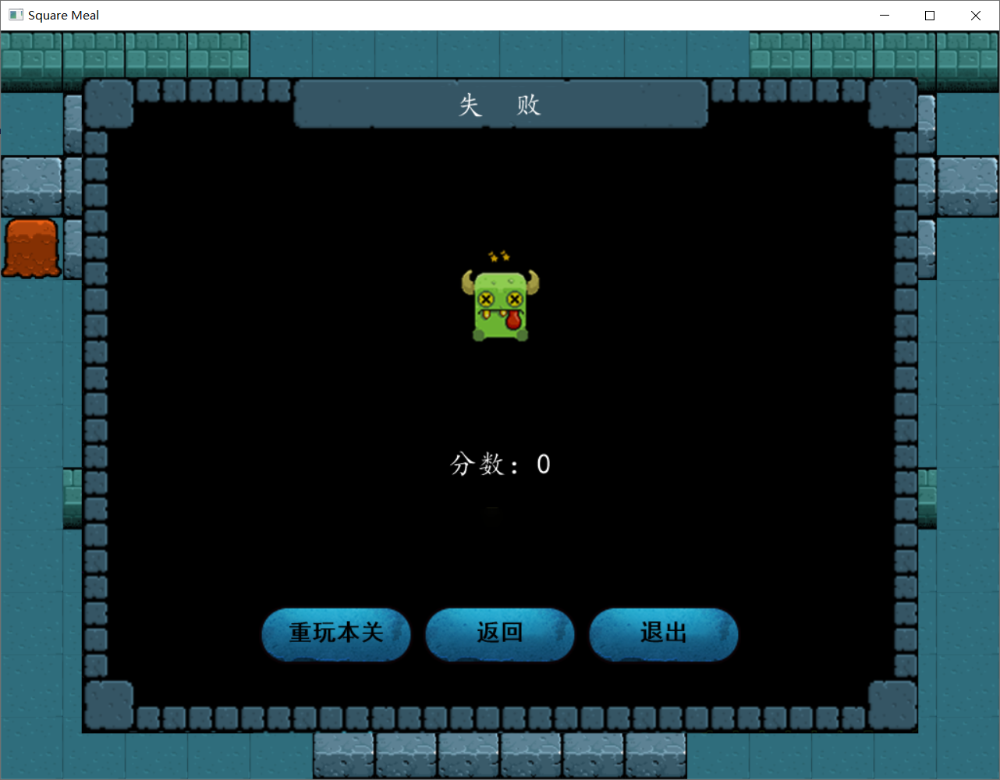
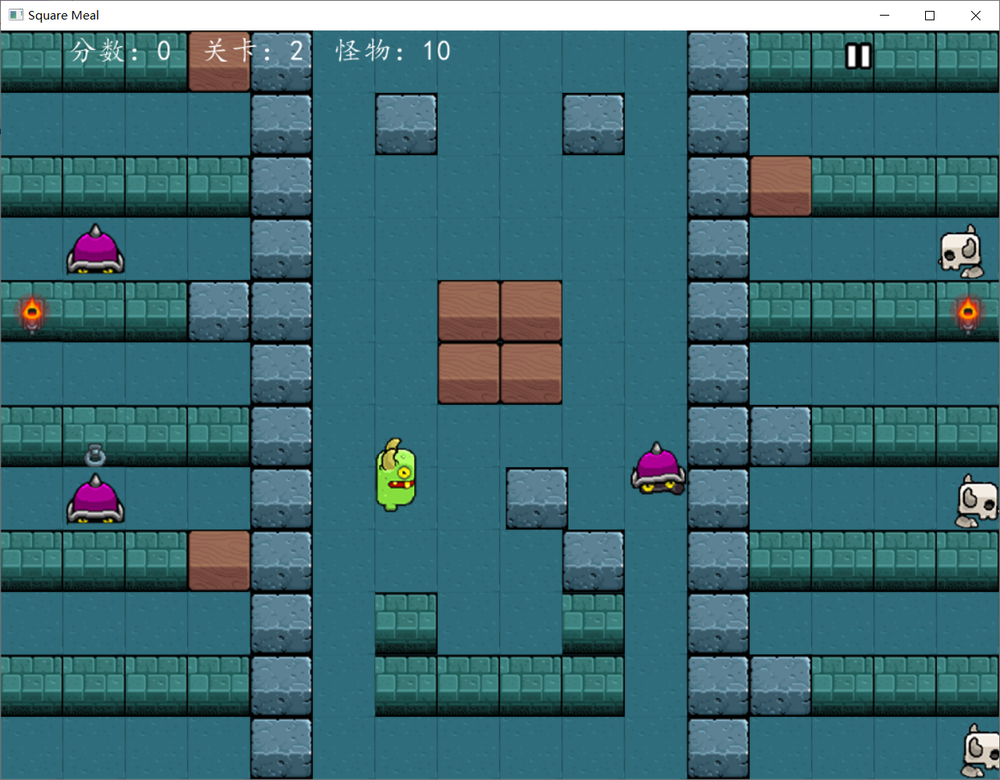
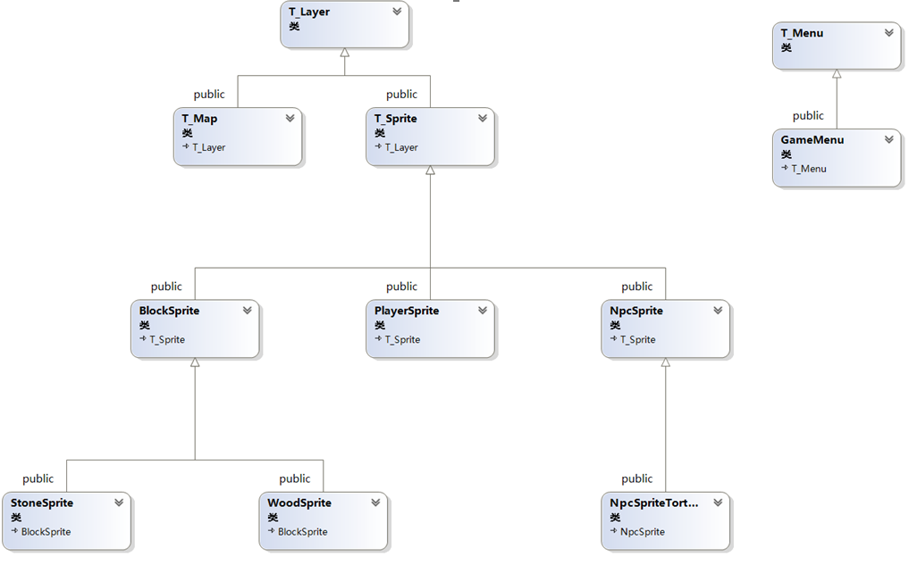
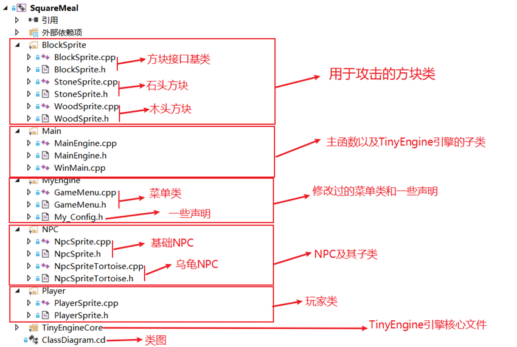
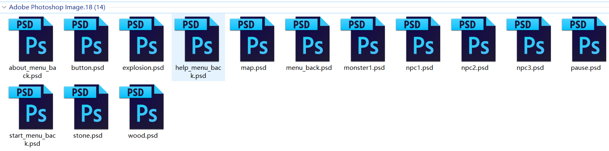
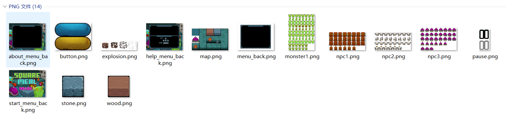
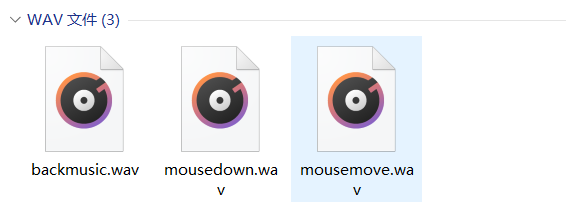

# 神奇小妖怪 (C++ 复刻版 )

### —— 基于 TinyEngine 游戏引擎

神奇的小妖怪，游戏的目的是打败敌人，解锁下一关，最终逃离地牢。你要吃掉敌人，在此之前你需要用道具把他们敲晕。敌人会一直游荡，直到被石头打晕，但是敌人有好几种（泥巴怪、小骷髅、小乌龟），不同的敌人有不同的技能，所以要当心！抓紧机会，迅速逃离！

### 程序设计部分

该游戏源代码中类的设计，除了TinyEngine引擎中的类以外，还包括继承自T_Sprite的PlaySprite玩家类、BlockSprite方块类、NpcSprite NPC类，继承自T_Menu的GameMenu游戏菜单类。

其中BlockSprite方块类要比其基类T_Sprite延申了两个重载函数StoneCllide，分别用于与地图的和NPC的碰撞。在该类中这两个函数都为纯虚函数，并由派生的两个子类来实现。这两个子类分别是StoneSprite和WoodSprite，分别对应石头和木头。

PlaySprite玩家类则在T_Sprite的基础上添加了独有的功能函数。

由于原来的T_Menu类不满足于该游戏菜单的绘制，并且有的菜单中还有精灵的动画。所以我们设计了GameMenu，该类依赖于T_Sprite，用于展示暂停动画。还重载了两个Draw函数，一个用于绘制无背景图片的菜单，一个用于绘制背景图片停留于界面前面但不遮罩界面。

 

源代码清单

素材源文件

 